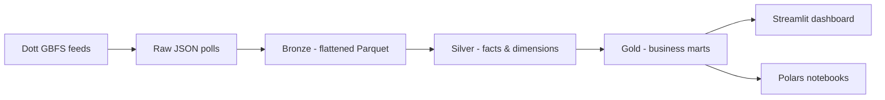

# Kraków Micromobility Analytics — GBFS Pipeline

**From live GBFS polls to business insights: DuckDB + dbt + Polars + Streamlit.**


---

## Overview

A complete, **local-first analytics pipeline** for Kraków's shared micromobility system operated by **Dott** (~400 parking hubs + ~900 free-floating e-scooters). Real-time **GBFS** feeds are polled into raw JSON, transformed through a **medallion architecture** (Bronze → Silver → Gold) with **dbt on DuckDB**, explored in **Polars-powered Jupyter notebooks**, and served through an interactive **Streamlit** dashboard.

No database server. No cloud. Everything runs on your laptop.

## What makes this different from a typical bike-share project

- **GBFS open standard** instead of a bespoke API — the industry-standard format used by operators worldwide
- **Hybrid system** — docked parking hubs *and* dockless vehicles with free GPS positions
- **Battery telemetry** — charge % and remaining range per vehicle, enabling fleet-health analytics unavailable in dock-only bike systems
- **Real operator pricing** — fares computed from the live `system_pricing_plans` feed (1.99 PLN unlock + 0.99 PLN/min), not invented constants
- **Dockless trip reconstruction** — rides inferred from consecutive GPS positions with a noise threshold, not from station check-ins

## Architecture



**Key techniques demonstrated:**
- `UNNEST` of GBFS arrays (`data.stations[]`, `data.bikes[]`, pricing tiers)
- `LEAD()` window functions and a **gaps-and-islands** pattern to reconstruct dockless rides from chained GPS deltas
- Haversine distance + nearest-station snapping for O-D attribution
- Weighted fleet aggregation across polls of unequal size
- Columnar Parquet storage with a unit-tested trip reconstruction model

## Business Questions

The Gold layer answers:

- Which parking hubs run dry most often and need rebalancing?
- How does fleet battery health evolve, and how many vehicles are effectively out of service?
- When do people ride, and what revenue does each hour generate under the real tariff?
- What are the strongest origin-destination flows between hubs?

## Repository Layout

```
krakow-micromobility/
├── ingestion/fetch_gbfs.py     # GBFS poller (dynamic + static feeds)
├── dbt-project/
│   ├── models/
│   │   ├── 01_bronze/          # JSON -> flat Parquet
│   │   ├── 02_silver/          # dims, facts, trip reconstruction
│   │   └── 03_gold/            # business marts
│   └── data/                   # raw JSON + Parquet layers (gitignored)
├── notebooks/                  # Polars exploration & insights
└── streamlit-app/              # interactive dashboard
```

## Technologies

| Layer | Tool | Why |
|---|---|---|
| Ingestion | Python + `requests` | GBFS polling (60 s dynamic, daily static) |
| Storage | Parquet + DuckDB | columnar, partitioned, zero-infra analytics |
| Modeling | dbt (`dbt-duckdb`) | versioned SQL, lineage, tests, docs |
| Exploration | Polars + Jupyter | fast, multi-threaded DataFrame analysis |
| Visualization | Streamlit, Folium, Plotly | interactive maps and charts |

## Setup

**Requirements:** Python 3.13+, [uv](https://docs.astral.sh/uv/), Git. ~8 GB RAM.

```bash
git clone <REPO_URL>
cd krakow-micromobility

# 1. Install dbt with the DuckDB adapter
uv tool install dbt-core --with dbt-duckdb
dbt --version

# 2. Install app dependencies
cd streamlit-app && uv sync && cd ..

# 3. Collect data — run for as long as you want a richer dataset
python ingestion/fetch_gbfs.py --loop 60

# 4. Build the warehouse
cd dbt-project
DBT_PROFILES_DIR=. dbt run --profiles-dir=.

# 5. Launch the dashboard
cd ../streamlit-app
uv run streamlit run app.py   # http://localhost:8501
```

## Data Model

**Silver (conformed grain):**
- `dim_stations` — one row per parking hub
- `fct_station_snapshots` — hub availability at each poll
- `fct_vehicle_snapshots` — vehicle position, battery, status at each poll
- `fct_vehicle_trips` — reconstructed rides (via `LEAD` on consecutive positions)

**Gold (business marts):**
- `mart_trips_enriched` — duration, distance, speed, fare from the real tariff
- `mart_station_utilization_hourly` — availability, empty share, service status
- `mart_fleet_health_hourly` — battery, range, disabled/reserved shares
- `mart_station_od_flows_hourly` — hub-to-hub flows via nearest-station snapping

## Example Analysis

```sql
SELECT
    hour,
    sum(revenue_pln) AS estimated_revenue
FROM read_parquet('dbt-project/data/gold/mart_trips_enriched.parquet')
GROUP BY 1
ORDER BY 1;
```

## Skills Demonstrated

- **Data engineering** — open-standard API ingestion, medallion architecture, partitioned columnar storage
- **Geospatial SQL** — haversine math, nearest-neighbor attribution for O-D flows
- **Event reconstruction** — turning position telemetry into rides with window functions, validated by a synthetic-data unit test (`tests/test_trip_reconstruction.py`)
- **Modern tooling** — dbt lineage & docs, DuckDB zero-infra analytics, Polars performance
- **Product delivery** — interactive dashboard covering supply, fleet health, and revenue

---

*Data source: [Dott GBFS feed for Kraków](https://gbfs.api.ridedott.com/public/v2/krakow/gbfs.json), registered in the [MobilityData GBFS systems catalogue](https://github.com/MobilityData/gbfs). Timestamps are UTC, normalized to `Europe/Warsaw` in the Bronze layer.*
